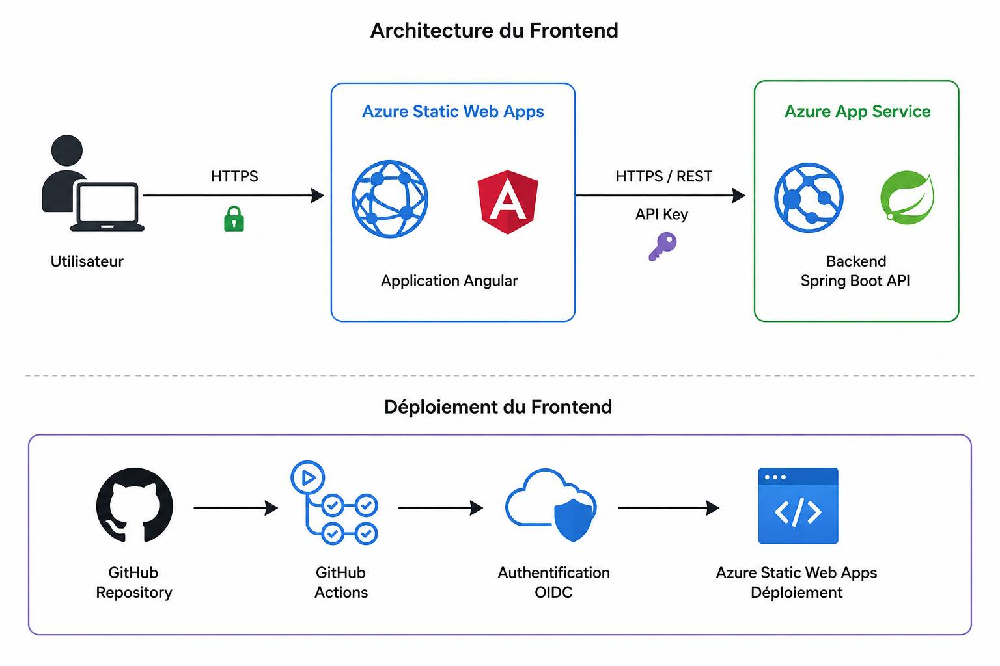

# Azure Quiz — Frontend

## Présentation

Ce dépôt contient le frontend de l'application **Azure Quiz**.

L'application est développée avec **Angular** et hébergée sur **Azure Static Web Apps**.

Elle communique avec le backend Spring Boot hébergé sur **Azure App Service**.

---

## Architecture

L'utilisateur accède à l'application Angular depuis Azure Static Web Apps.

Le frontend communique en HTTPS avec l'API du backend hébergée sur Azure App Service.

L'infrastructure Azure est créée et maintenue séparément avec Terraform.

---

## Technologies

- Angular
- TypeScript
- Node.js
- npm
- Azure Static Web Apps
- GitHub Actions

---

## CI/CD

Le projet utilise GitHub Actions pour automatiser l'intégration et le déploiement.

La CI vérifie la qualité du code, exécute les tests et construit l'application.

Le CD construit la version de production et la déploie sur Azure Static Web Apps.

L'authentification entre GitHub Actions et Azure utilise OIDC.

---

## Sécurité

Le frontend communique avec le backend en HTTPS.

Le backend limite les origines autorisées avec CORS.

Des contrôles de sécurité sont également exécutés dans la CI afin de détecter les vulnérabilités et les secrets éventuellement présents dans le dépôt.

---

## Déploiement

Le frontend est hébergé sur **Azure Static Web Apps**.

L'infrastructure Azure associée est gérée dans le dépôt Terraform du projet.